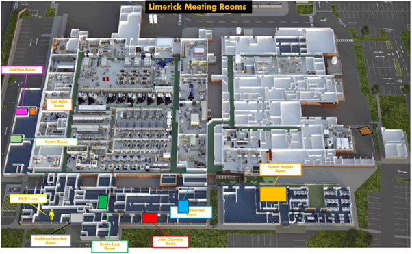

Plant Overview
==============

Plant Layout and Key Locations
-------------------------------
Below you can see our plant and its layout. About 80% of the floor space is the factory, with the offices wrapping around the bottom and up to the left. 

There are 4 main areas of the office.
- **Operations and Engineering**: This is the area in the middle left, where about 75 people sit. The Triathlon, Dall Milles, and Exeter meeting rooms are here. 
- **HR & Automation**: This is where ourselves and the HR team sit, down on the bottom left. The Kathleen Lonsdale meeting room is here. 
- **Main Office Area**: This is in the bottom middle, and it is where the finance team and senior management offices are, along with a big hot desk area. The John Charnley and Emile Letournel meeting rooms are here. 
- **IT Area** This is at the back of the Main Office Area. 
- **AO Area** Short for Advanced Operations, this is a bit seperated from the rest of the offices, and it is where 28 of our colleagues sit. Its also where our biggest meeting room, the Homer Stryker room is, and where you'll do your safety inductions. 

